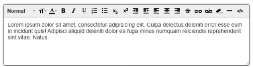

# JavaScript Text Editor (JS TE)

JavaScript Text Editor (JS TE) is a lightweight JavaScript library for creating WYSIWYG text editors in web applications. It transforms a simple HTML container into a rich text editor, similar to classic solutions like TinyMCE, but without external frameworks or dependencies.

## Features

- Seamless integration with modern and legacy browsers
- No external frameworks or dependencies required
- Intuitive WYSIWYG editing experience
- Toolbar with formatting buttons for quick access
- Customizable appearance via CSS
- Supported formatting options:
  - Bold, italic, underline, strikethrough
  - Ordered and unordered lists
  - Headings (h1-h6), blockquotes
  - Links (add/remove)
  - Text color
  - Font size
  - Indent/outdent
  - Text alignment
  - Horizontal rule
  - Source view

## Editor Interface Example

Below is a screenshot of the JS TE editor interface:



## Quick Start

Using JS TE is simple. You can initialize the editor with a single line of code:

```javascript
jste(htmlSelector);
```

For example, if you have an HTML `div` or `span` container with an `id` of "editor":

```javascript
jste("#editor");
```

You can use any valid CSS selector.

## Installation

1. Download the library from the [GitHub repository](https://github.com/tkdesign/jste) or clone the project.
2. In your project directory, install the required dependencies:

   ```bash
   npm install --save-dev
   ```

3. Generate the distributable version:

   ```bash
   npm run dist
   ```

4. Include the library in your HTML:

   ```html
   <link type="text/css" rel="stylesheet" href="jste.css" />
   <script type="text/javascript" src="jste.min.js"></script>
   ```

5. Create an HTML container for the editor:

   ```html
   <span id="editor">Lorem ipsum dolor sit amet, consectetur adipisicing elit...</span>
   ```

6. Initialize the editor:

   ```html
   <script>
     const editor = jste('#editor');
   </script>
   ```

## Copyright
Author: Petr Kovalenko, 2023.

## License
This project is licensed under the MIT License. See the [LICENSE](LICENSE) file for details.